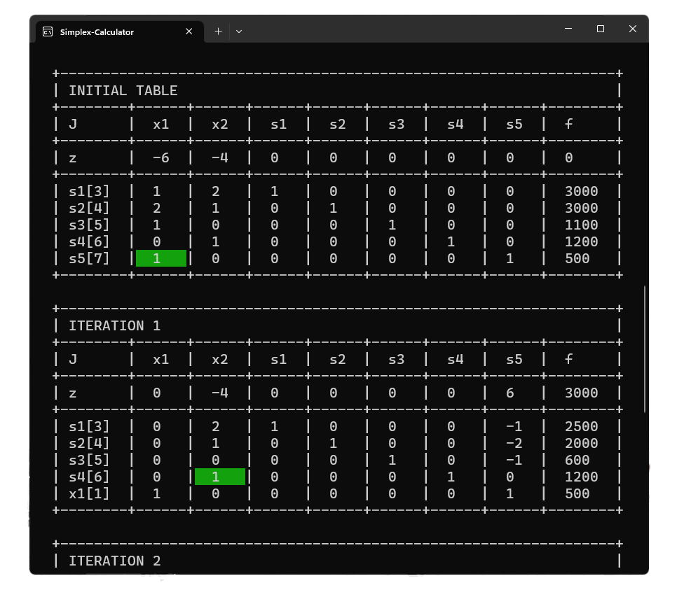
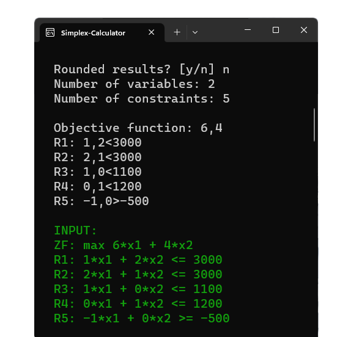
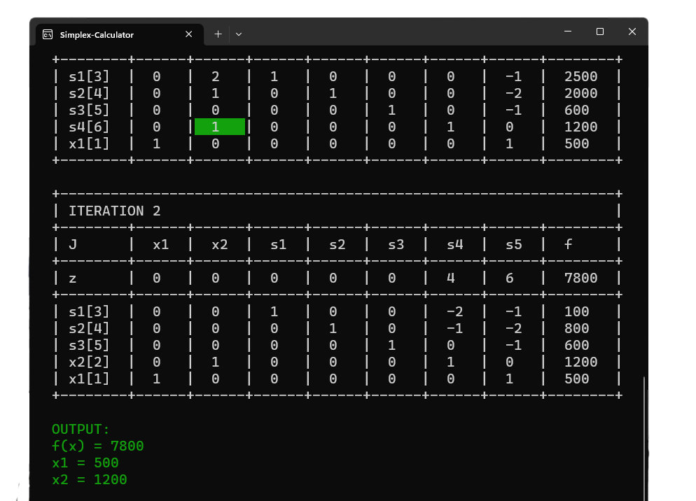

# Simplex Calculator

Simplex Calculator is a Java console app for solving linear programming problems. The traditional simplex method is used and the two-phase method where applicable. This program primarily serves educational purposes.
* **Optimal solution** to **any linear problem** if a solution does exist.
* Detection for **infeasible** and **unbounded** problems.
* Two calculation modes: **Exact** and **Rounded**.
* **Intermediate tableaus** are shown and the **pivot element** is highlighted for each iteration. This way you can check the results you obtained when solving the problem manually.

Enjoy!

      

For a video demo see [Simplex Calculator](https://drive.google.com/drive/folders/1gH_82MVWjv0lWRdNeFJ7r9ySENtS2a6k?usp=sharing%3E).

## Calculation Modes

* **Exact:** Calculation with simplified fractions
* **Rounded**: Calculation with decimals rounded to a certain mantissa using optimal rounding and "round half to even". Rounding takes place after each step of the calculation.

## Number Input
Numbers can be entered as integer, fraction or decimal number, e.g. *'123'*, *'123/321'* or *'123.321'*.

## Usage

**1. Specify your problem bounds:**
   * Select calculation mode (exact/rounded)
   * Choose the number of variables for your problem, e.g. *'2'*.
   * Choose the number of constraints for your problem, e.g. *'5'*.

**2. Enter your linear problem:**
   * Enter your objective function, e.g. *'6,4'* which will equal *'max f(x) = 6\*x1 + 4\*x2'*.
   * Enter your constraints and put a relation sign before each restraint value, e.g. *'2,3>1200'* which will equal *'2\*x1 + 3\*x2 >= 1200'*. Supported relation signs are *'<'*, *'>'* and *'='*. Instead of *'<'* you may also use *','*.
   * After you press *ENTER* your provided linear problem will show up below.

      

## Interpreting Solutions
The optimal solution is displayed at the very end of the output. To further interpret the solution you should also look at the last tableau as it contains the vector of the reduced costs as well as other important information.

      

## Requirements
* The app requires at least **Java 16**.
* If your operating system is Windows I suggest running the app in [Windows Terminal](https://github.com/microsoft/terminal) with a recent version of [PowerShell](https://github.com/PowerShell/PowerShell). Alternatively you should use another terminal application which supports ANSI escape codes.
